# Telco churn visuals (gallery)

## boxplots_by_churn_after

\newpage

## boxplots_by_churn_before

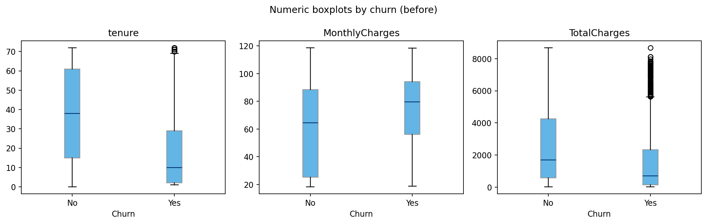

\newpage

## churn_balance_after_train_bar

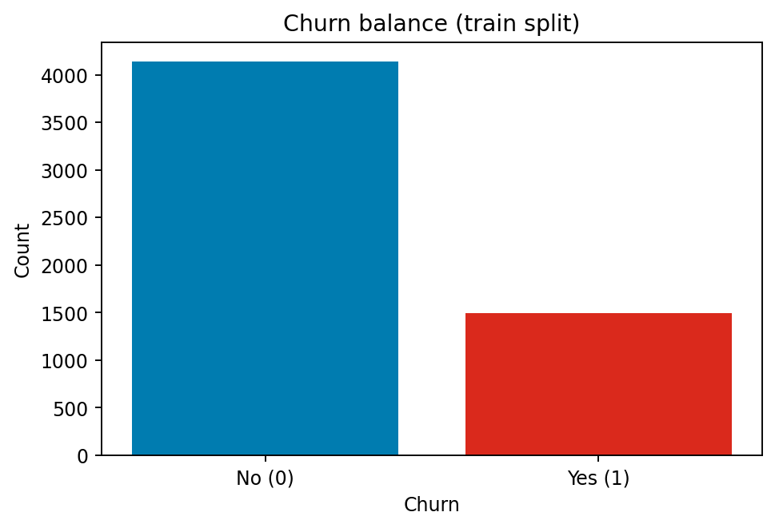

\newpage

## churn_balance_after_train_pie

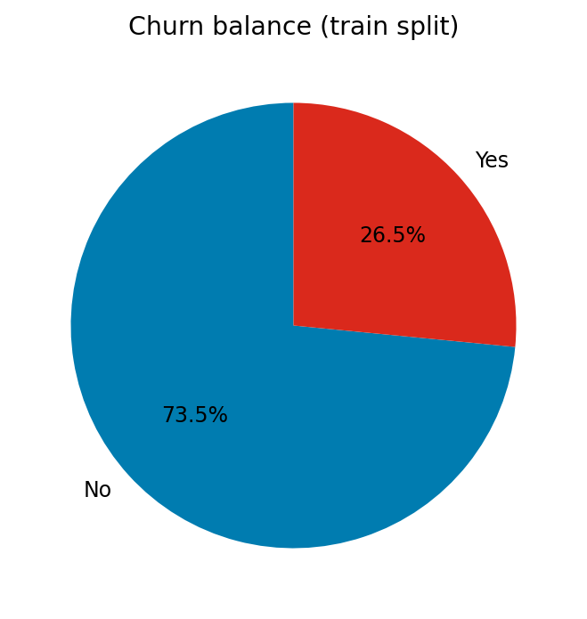

\newpage

## churn_balance_before_bar

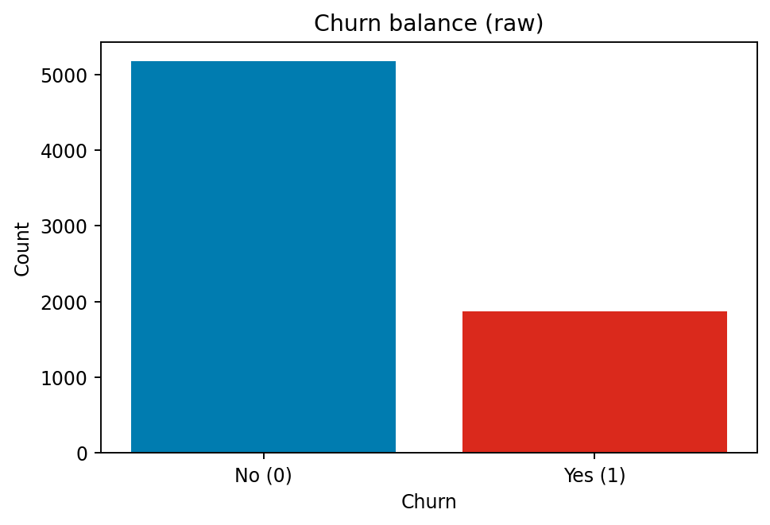

\newpage

## churn_balance_before_pie

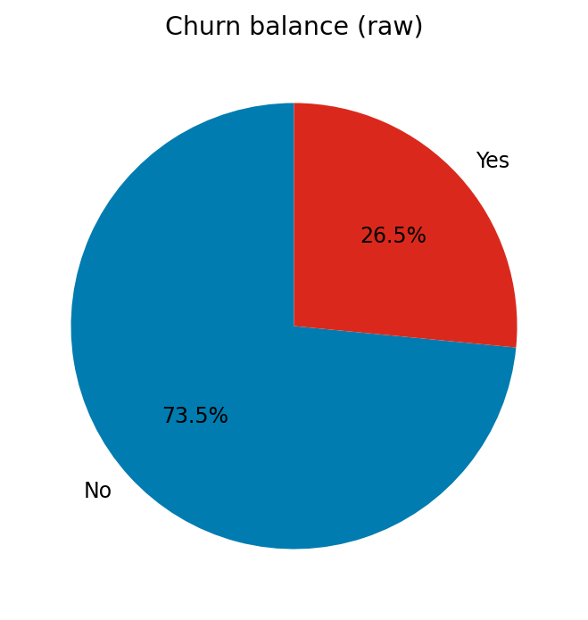

\newpage

## churn_by_Contract

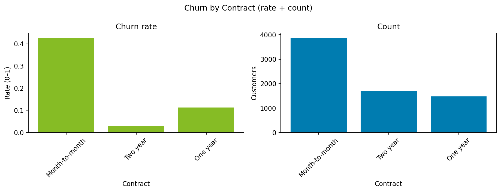

\newpage

## churn_by_InternetService

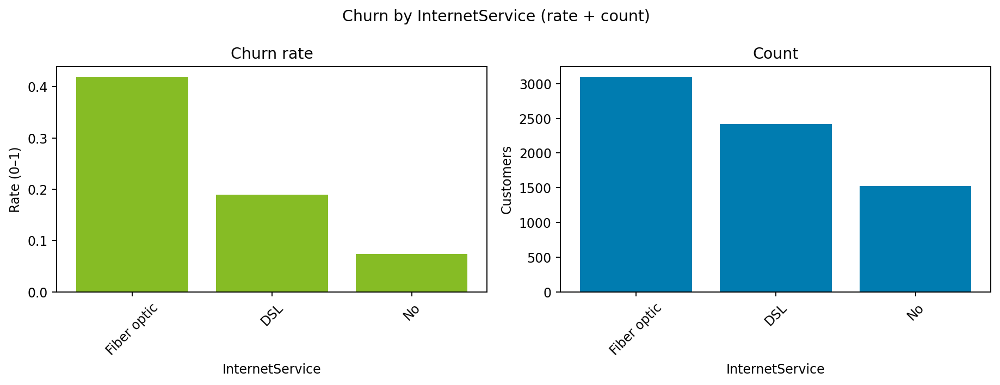

\newpage

## churn_by_PaymentMethod

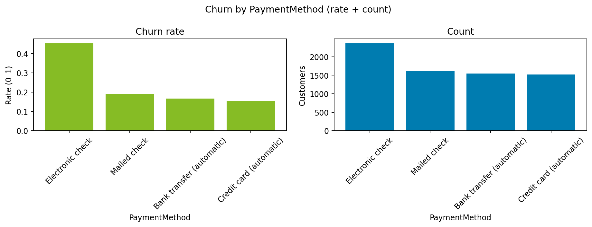

\newpage

## churn_by_SeniorCitizen

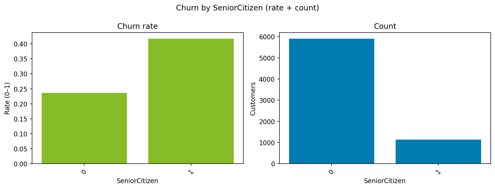

\newpage

## churn_by_TechSupport

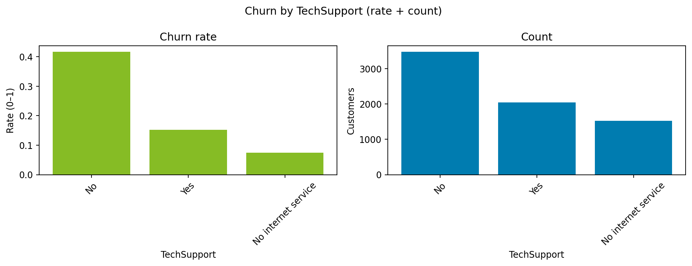

\newpage

## missing_by_column_after

\newpage

## missing_by_column_before

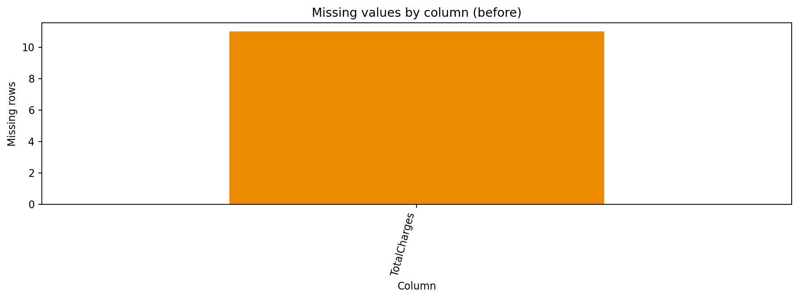

\newpage

## numeric_corr_after

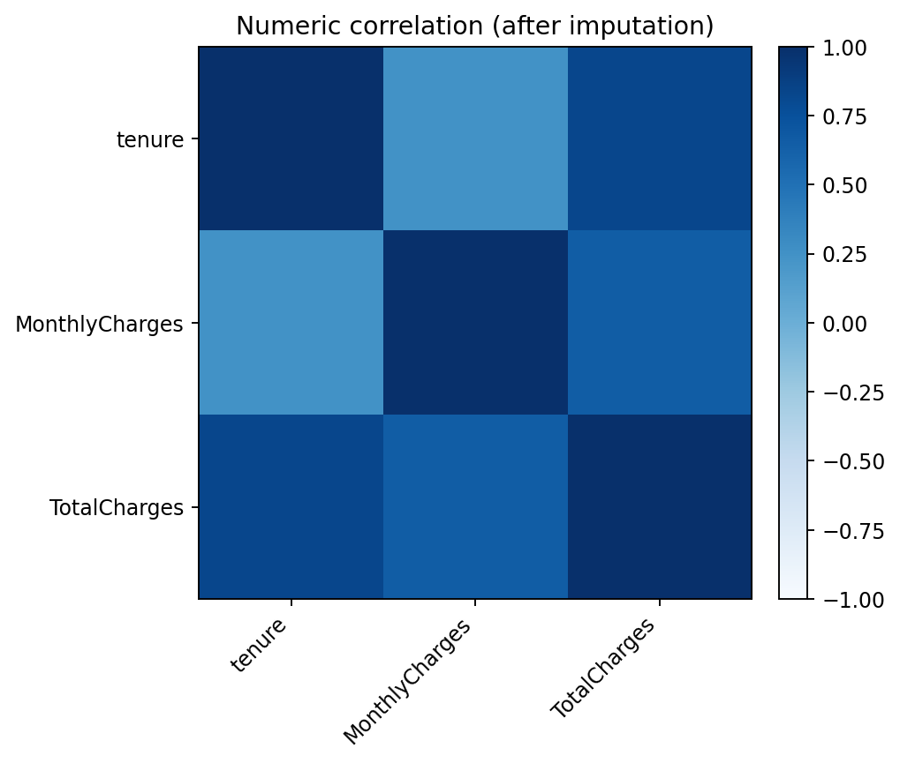

\newpage

## numeric_corr_before

\newpage

## numeric_hist_after

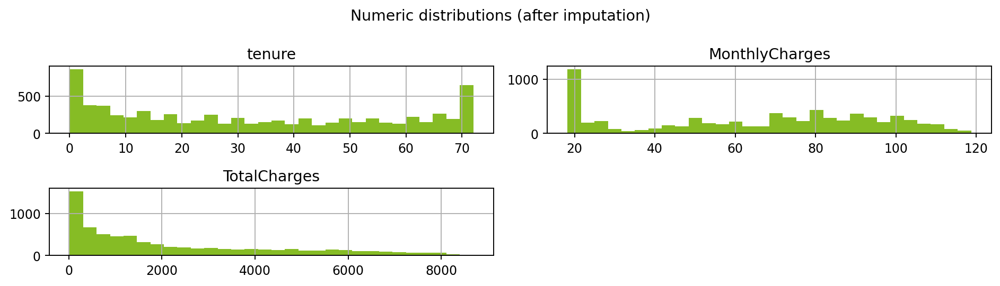

\newpage

## numeric_hist_before

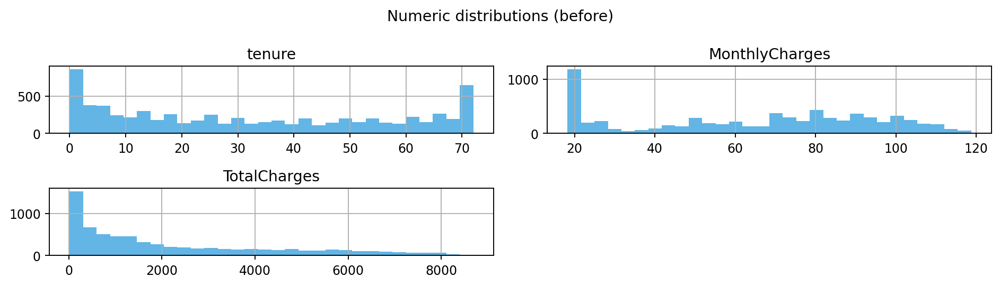

\newpage

## svd_after_full_preprocess

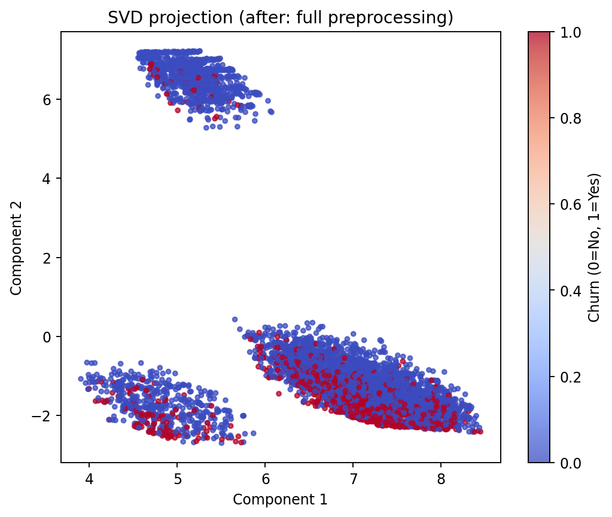

\newpage

## svd_before_numeric_only

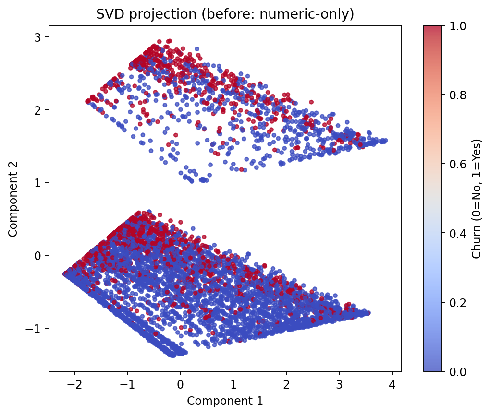

\newpage

